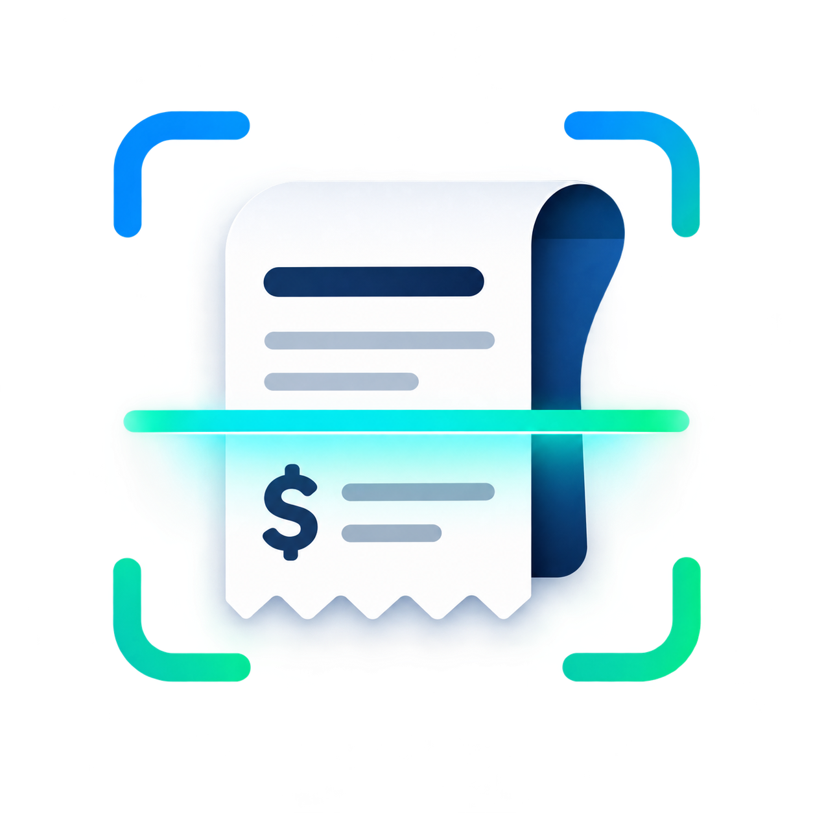

<p align="left">
  
</p>

# Receipt Capture & Expense Tracker — PWA with OCR Pipeline

A lightweight tool for field employees to photograph a receipt, get
vendor/date/amount extracted automatically, review and confirm the data, and
keep the record for later approval and reporting.

**Painel (produção):** https://painel.cpp.macielsuassunadev.com.br

- **Frontend**: Next.js (App Router, React 19) + Tailwind CSS v4 + shadcn/ui. Installable PWA (manifest + app-shell service worker).
- **Backend**: Node.js/TypeScript with Elysia + Bun, hexagonal architecture.
- **Database/Auth/Storage**: Supabase (Postgres + RLS + Auth). Receipts stored on Backblaze B2 (S3-compatible).
- **OCR**: pluggable engines — a simulated local stub (with retries, low-confidence and failure modes) and a real Google Vision adapter.

## Architecture

```
front/   Next.js PWA (React, Tailwind, shadcn/ui, react-query, nuqs)
server/  Elysia (Bun) REST API — hexagonal: use-cases / ports / adapters
         supabase/migrations/  Postgres schema + RLS policies
```

Server modules are organized by the hexagonal pattern:

```
src/
  core/        entities, ports (interfaces), domain errors
  use-cases/   auth, expenses (OCR submit, confirm, list, status change)
  adapters/    supabase (auth, repo), storage (B2), ocr (mock + google vision)
  http/        controllers + auth middleware
  plugins/     Elysia plugin wiring
```

The status lifecycle is handled in exactly one place,
`src/use-cases/expenses/status-change.use-case.ts`. Every transition flows
through it, and its `notify()` method is the seam where a future
notification (email/push) plugs in — today it only logs.

## Features

- **Auth**: sign up / log in / log out via Supabase Auth. Every expense route requires an authenticated user (server middleware + DB RLS).
- **Receipt capture**: pick a file or upload from the phone camera; desktop falls back to a file picker.
- **OCR pipeline**: pluggable engines behind an `OcrServicePort`. Two adapters ship:
  - **Mock (simulated)**: a short delay, then plausible fields plus a confidence score. It occasionally returns a **low-confidence** result (→ `needs_attention`), and occasionally **fails**, with automatic retries (up to 3 attempts, then `needs_attention` + `ocr_error`). This is the default and requires no external setup.
  - **Google Vision (real)**: `POST /expenses/ocr` runs `DOCUMENT_TEXT_DETECTION` and parses the returned text (vendor/date/amount/currency). Requires `GOOGLE_VISION_API_KEY`; without it the endpoint fails safely into `needs_attention` + `ocr_error` after retries.
- **Review & confirm**: extracted fields pre-fill a form; the user corrects and confirms. Once confirmed the fields are locked.
- **Expense statuses**: `pending_review` → `confirmed`, `needs_attention` → `confirmed`. Transitions validated centrally.
- **Query Options**: paginated, with filters by status and vendor.
- **OCR engine selection**: the frontend upload form lets you choose between the simulated and Google Vision engines (`useSubmitReceipt("mock" | "google")`).

## Project structure (monorepo)

```
.
├── front/   Next.js PWA
├── server/  Elysia/Bun API + Supabase migrations
└── README.md
```

---

## Running the project

Both apps need environment variables. See each folder's `.env.example` for the
shape (the exact placeholders below).

### 1. Supabase setup

1. Create a project at [supabase.com](https://supabase.com).
2. Run the migration in `server/supabase/migrations/001_expenses.sql` against your database (SQL Editor or `supabase db push`). It creates the `expenses` table, indexes, **Row-Level Security** policies (users can only read/write their own rows), and a `updated_at` trigger.
3. Auth is used with the email/OTP or email/password flow. Capture the project URL and the publishable + secret (service-role) keys, plus the JWKS URL (`<project-ref>.supabase.co/auth/v1/.well-known/jwks.json`).

### 2. Backend (server)

```bash
cd server
bun install
cp .env.example .env.local   # fill in values, see below
bun run dev                  # Elysia on :3001 by default
```

Required environment variables (`server/src/lib/env.ts`):

| Variable | Description |
| --- | --- |
| `SUPABASE_URL` | Supabase project URL |
| `SUPABASE_PUBLISHABLE_KEY` | Supabase anon/publishable key |
| `SUPABASE_SECRET_KEY` | Supabase service-role key (server only) |
| `SUPABASE_JWKS_URL` | `https://<ref>.supabase.co/auth/v1/.well-known/jwks.json` |
| `B2_APPLICATION_KEY_ID` | Backblaze B2 application key ID |
| `B2_APPLICATION_KEY` | Backblaze B2 application key |
| `B2_BUCKET` | B2 bucket name |
| `B2_ENDPOINT` | S3 endpoint, e.g. `https://s3.<region>.backblazeb2.com` |
| `B2_PREFIX` | (optional) key prefix inside the bucket |
| `GOOGLE_VISION_API_KEY` | (optional) chave da API do Google Vision para OCR real (`/expenses/ocr`) |
| `PORT` | (optional) default `3001` |
| `FRONTEND_ORIGIN` | (optional) comma-separated allowed CORS origins |

**Storage shortcut**: if you want to skip B2, point the storage adapter at any
S3-compatible bucket (MinIO, localstack) or swap the adapter for a local one —
the storage is behind a port so it can be swapped.

### 3. Frontend (front)

```bash
cd front
bun install
cp .env.example .env.local   # fill in values, see below
bun run dev                  # Next.js on :3000
```

Required environment variables (see `front/src/env.ts`):

| Variable | Description |
| --- | --- |
| `NEXT_PUBLIC_SUPABASE_URL` | Supabase project URL |
| `NEXT_PUBLIC_SUPABASE_PUBLISHABLE_KEY` | Supabase anon/publishable key |
| `NEXT_PUBLIC_API_URL` | Backend base URL, e.g. `http://localhost:3001` |

### 4. Open the app

Open http://localhost:3000, create an account, upload a receipt and review it.

---

## Data residency

The application stores data in Supabase (Postgres) and receipt images in
Backblaze B2. Data-residency placement depends on the regions you select for
your Supabase project and your B2 bucket. This implementation does not enforce
or assume a specific residency region; pick applicable regions for your
organization's compliance requirements (e.g. `us-east-005` for the bucket in
this repo's config). No data is processed or stored outside the regions you
configure for those two services.

## Roadmap

- **Real notifications**: wire the `status-change` notify seam to email/push
  instead of `console.log`.
- **Edge Function for OCR trigger**: move the OCR-trigger step into a Supabase
  Edge Function, or an async job queue, instead of an inline await.
- **Sharper receipt parsing**: the Google Vision parser is a heuristic on raw
  text; a provider with a built-in receipt model (AWS Textract `Expense`, Azure
  Document Intelligence `Receipt`) would extract fields more reliably.
- **Capacitor wrap + native camera plugin** for a first-class camera experience.
- **App-shell precache** of dynamic routes via a build-time manifest (currently
  the service worker caches the shell + static assets only).
- **Date-range filter** and sorting by status priority (needs_attention >
  pending_review > confirmed, most recent first within each group).

## Tests

The server has unit tests under `server/test/` covering the domain use-cases
(status transitions, OCR submit + retries, receipt parsing, listing
pagination/filter). Run with `bun test` in `server/` (see `server/README.md` /
package.json).

## License

Private.
